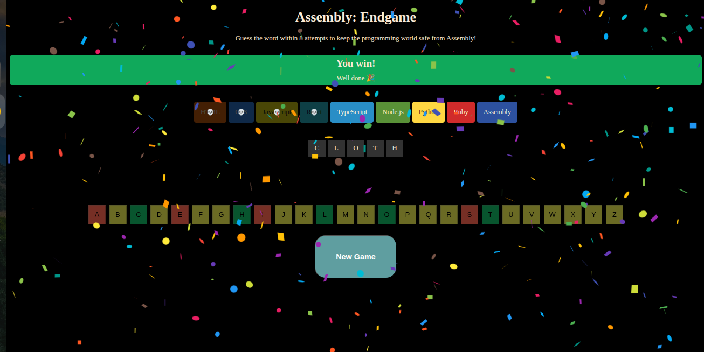
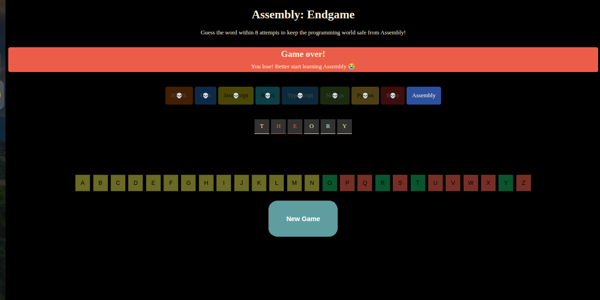

🧩 Assembly End Game

A responsive and interactive word puzzle game built using React.js and Vite, where players guess the correct word before losing all attempts. The game provides real-time feedback, animated states, and smooth UI transitions for an engaging experience.

🚀 Live Demo

👉 https://assembly-end-game-omega.vercel.app/

🛠️ Tech Stack

1. React.js
2. JavaScript (ES6+)
3. Vite
4. HTML5
5. CSS3

✨ Features

🎯 Dynamic word validation logic

🔄 Real-time UI updates using React state

🧠 Efficient state management with React Hooks

🎨 Animated game status indicators

📱 Fully responsive design

♻️ Reusable and modular components

🧩 How It Works

The player attempts to guess the correct word letter by letter.

Incorrect guesses reduce remaining attempts.

The UI updates dynamically based on game state (Win / Lose / Ongoing).

Game resets automatically after completion.

⚙️ Installation & Setup

# Clone the repository:

git clone https://github.com/your-username/assembly-endgame.git

# Navigate to the project folder:

cd assembly-endgame

# Install dependencies:

npm install

# Run the development server:

npm run dev

📸 Screenshots

  
  

  
  

💡 Key Learning Outcomes

Improved understanding of React component architecture

Practical implementation of state-driven UI updates

Handling conditional rendering and game logic

Writing clean, maintainable, and reusable code

🔮 Future Improvements

Add difficulty levels

Add timer-based gameplay

Store high scores using local storage

Add sound effects
